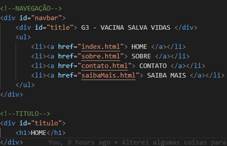
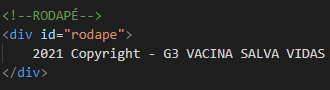
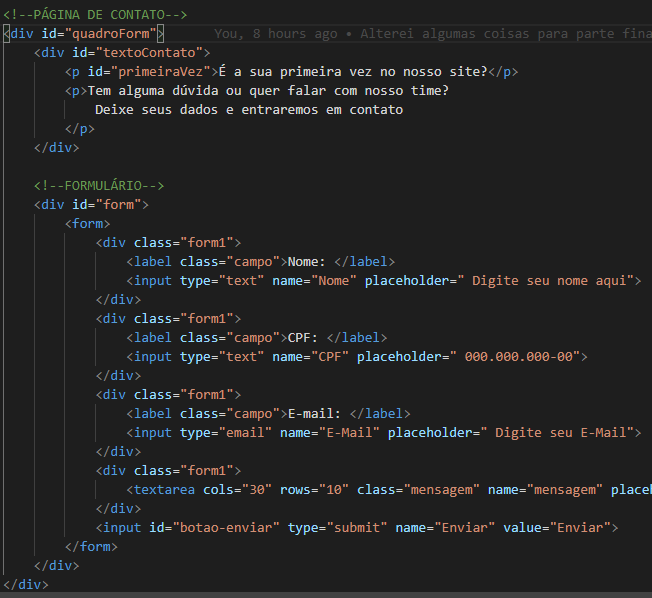

# Documentação

O projeto é uma landing page com as 6 melhores notícias sobre o COVID-19. Nele, contém 3 outras pages como Quem Somos, Contato e Saiba mais. 

Foi feito em <b>HTML</b> e <b>CSS</b>.

Começando pelo formato <b>HTML</b>:

Em todas as páginas, tem divisões padrões: navegação, título (trocando de nome conforme página diferente) e rodapé.

<b>Navegação</b> e <b>Título</b>

<b>Rodapé</b>

Na página principal chamada Início, contém 6 notícias positivas escolhidas por grupo 03. Incluindo as descrições de imagens para cegos poderem ler de forma satisfatória. 

Nesta página <b>principal</b>, contém 5 divisões: Imagens principais, Início de notícias, Quadro 1 e 2 de notícias com imagens, e Quadro 3 de notícia com vídeo. E nesse quadro 3, tem video configurado no HTML para funcionar normalmente. 

<b>Imagens principais</b>, <b>Início de notícias</b> e <b>Quadro 1 de notícias com imagens</b>

<b>Quadro 2 de notícias com imagens</b> e <b>Quadro 3 de notícia com video</b>

<b>No quadro 3, mostra vídeo configurado</b>

Nesta página <b>Quem Somos</b>, contém 2 divisões: Quadros 1 e 2 de colaboradores do grupo 03.

<b>Quadros 1 e 2 de colaboradores do grupo 03</b>

Nesta página <b>Contato</b>, contém 1 divisão pai que tem formulário e texto geral de forma interna.

<b>Formulário</b> e <b>Texto Geral</b>

Nesta página Saiba Mais, contém 1 divisão pai e vários divisões filhos.

<b>Quadro 1 de fontes internas</b>

No formato <b>CSS</b>, tem vários componentes que encontramos e conhecemos na internet e mostraremos quais os componentes que fomos aprender fora das aulas de HTML e CSS do professor Isidro.

<b>Display: block</b> é quando CSS faz com que HTML se comporte como bloco. 

<b>Display: inline-block</b> é quando CSS faz com que HTML se comporte como um elemento em linha, porém inline não define propriedades de largura e altura, ai adiciona block para mexer essas propriedades.

<b>Display: inline-flex</b> aplica layout flexível aos itens flexíveis ou filhos, bem como ao próprio container. Como resultado, o contêiner se comporta como um elemento flexível inline, assim como os filhos fazem e, portanto, ocupa a largura exigida apenas pelos itens/filhos e não pela largura total da tela.

<b>Display: table</b> faz com que HTML se comporte como tabela.

<b>Display: Table-cell</b> utiliza HTML com div filho que faz ligação com tabela pai (Display: table) 

<b>Line-height</b> permite controlar o espaçamento entre as linhas de um texto.

<b>Position</b> é uma propriedade utilizada para determinar o posicionamento dos elementos na página. Ela é usada em conjunto com propriedades auxiliares, entre elas: bottom, top, left e right, que ajudam a definir de que forma o elemento será posicionado na tela.

<b>Position relative</b> determina que o elemento será posicionado de acordo com o fluxo natural da página
linear-gradient é misturar as cores similares dentro do background image. Background color não permite esse componente.

<b>ul li a:link, ul li a:visited</b> acontece quando link está no estado inicial e visited no estilo do link visitado. Isso é feito no efeito cascata que torna possível fazer hover quando mouse passa por link.

<b>ul li a:hover</b> acontece quando seletores de link e visited forem criados, mouse conseguirá passar por link e ver cor diferente (de branco para laranja).

<h1>Referências</h1>

1 - <b>Como montar vídeo no html</b>: https://www.devmedia.com.br/html5-video-tutorial/28790

2 - <b>Display: block</b> : https://medium.com/collabcode/pare-de-chutar-e-aprenda-como-funciona-o-display-block-98480c987950

3 - <b>Display: inline-block</b>: https://www.maujor.com/tutorial/propriedade-css-display.php

4 - <b>Display: inline-flex:</b>: https://www.ti-enxame.com/pt/css/qual-diferenca-entre-display-inline-flex-e-display-flex/1050086644/

5 - <b>Display: table e Display: table-cell</b>: https://pt.stackoverflow.com/questions/401545/qual-o-uso-apropriado-do-display-table

6 - <b>Line-height</b>: https://www.maujor.com/tutorial/propriedade-css-line-height.php

7 - <b>Position</b>: https://blog.betrybe.com/css/css-position/#:~:text=No%20CSS%2C%20o%20CSS%20position,elemento%20ser%C3%A1%20posicionado%20na%20tela.

8 - <b>Position: relative</b>: https://blog.betrybe.com/css/css-position/#:~:text=A%20propriedade%20CSS%20position%20relative,de%20acordo%20com%20as%20indica%C3%A7%C3%B5es.

9 - <b>Estilização de links(Link, Visited e Hover)</b>: https://www.maujor.com/tutorial/csslinks.php 

